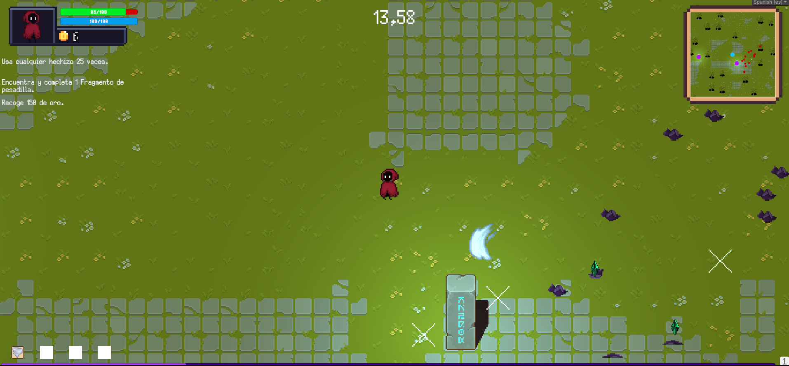

# **Aethersoul**

**Breve descripción del proyecto:**
Aethersoul es un videojuego del género Roguelite desarrollado en Unity utilizando Entity Component System (ECS) el framework orientado a datos de Unity.

---

## **Tabla de Contenidos**
1. [Características](#características)
2. [Tecnologías Utilizadas](#tecnologías-utilizadas)
3. [Requisitos del Sistema](#requisitos-del-sistema)
4. [Instalación](#instalación)
5. [Cómo Jugar](#cómo-jugar)
6. [Arquitectura del Proyecto](#arquitectura-del-proyecto)
7. [Capturas de Pantalla](#capturas-de-pantalla)
8. [Créditos](#créditos)
9. [Licencia](#licencia)

---

## **Características**
- **ECS Architecture:** Implementación de Unity ECS para optimizar el rendimiento.

---

## **Tecnologías Utilizadas**
- **Unity:** Versión 2022.3.51f1

---

## **Requisitos del Sistema**
- **Sistema Operativo:** Windows
- **Procesador:** TBD
- **Memoria RAM:** TBD
- **GPU:** TBD
- **Espacio en Disco:** 150MB

---

## **Instalación**
Hay dos formas de ejecutar el juego.

1. Descargando una versión precompilada desde el apartado [Releases](https://github.com/Tonipzr/aethersoul/releases)

2. Ejecutar el juego desde el Editor de Unity. Para ello, se deben seguir los siguientes pasos.
    1. Clonar el repositorio:
    ```bash
        git clone https://github.com/Tonipzr/aethersoul
    ```
    2. Abrir el proyecto descargado mediante Unity, utilizando la versión 2022.3.51f1.
    3. Ejecutar desde el propio editor.

---

## **Cómo Jugar**
Nada más abrir el juego nos aparecerá el menú principal. Desde este menú se puede acceder tanto al juego como a la *Dream City*

### Juego
El juego consiste en matar enemigos para subir de nivel. Cada vez que subimos de nivel obtendremos oro y una elección de mejora.
Estas mejoras se perderán si nuestro personaje muere, pero podremos utilizar el oro en mejoras persistentes que no se perderán.

#### Controles
- El movimiento del personaje funciona mediante **WASD**.
- El **Espacio** permite realizar un *dash*.
- La **E** nos permite interactuar.
- Los botones **1, 2 ,3 y 4** sirven para utilizar las habilidades.
- El botón **Escape** accede al menú de pausa.
- En las builds de desarrollo, mediante el botón **P** accedemos al menú de debug que nos permite aprender cualquier habilidad.

### DreamCity
La Dream City es el sistema de mejoras persistentes que se ha desarrollado para que no se pierda por completo el progreso de la partida.
Desde este lugar se puede gastar el oro obtenido durante la partida para obtener mejoras permanentes.

---

## **Arquitectura del Proyecto**

El código está dividido siguiendo la estructura ECS.
- Entidades
- Sistemas
- Componentes

---

## **Capturas de Pantalla**

### Menú principal


### Juego


### Dream City

---

## **Créditos**

---

## **Licencia**
